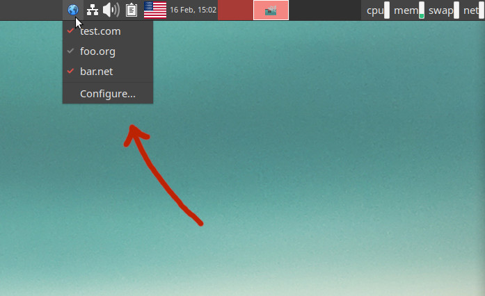
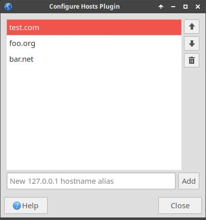

# XFCE Hosts Plugin

This provides an XFCE panel plugin to quickly enable/disable hosts inside `/etc/hosts`. It's intended
for web development use, where e.g. you want your local web server to point to `www.example.com`
domain to match how it will be when deployed.

After installation, go to XFCE panel **Add new items...** dialog and select the **Hosts Plugin**.
You'll get a tray icon like so:



Select **Configure...** or right click and view **Properties** to configure the list of hosts:



When you toggle a host, it will sync the `/etc/hosts` file. This requires superuser privileges,
so you may be prompted for sudo password. Superuser authentication goes through Polkit and is
configured to keep authentication so you can enable/disable freely for sometime. Most distributions
this is 5mins before you need to enter a password again.

Currently this plugin only configures 127.0.0.1 host aliases, as its intended for local web
development.

## Build / Installation

Update `configure.ac` as needed, e.g. to change install paths.

```shell
> sudo apt install xfce4-dev-tools autopoint libxfce4ui-2-dev
> ./autogen.sh
> make
> sudo make install
> xfce4-panel --restart
```

For debugging, you can run do:

```shell
> xfce4-panel -q
> PANEL_DEBUG=1 xfce4-panel
```